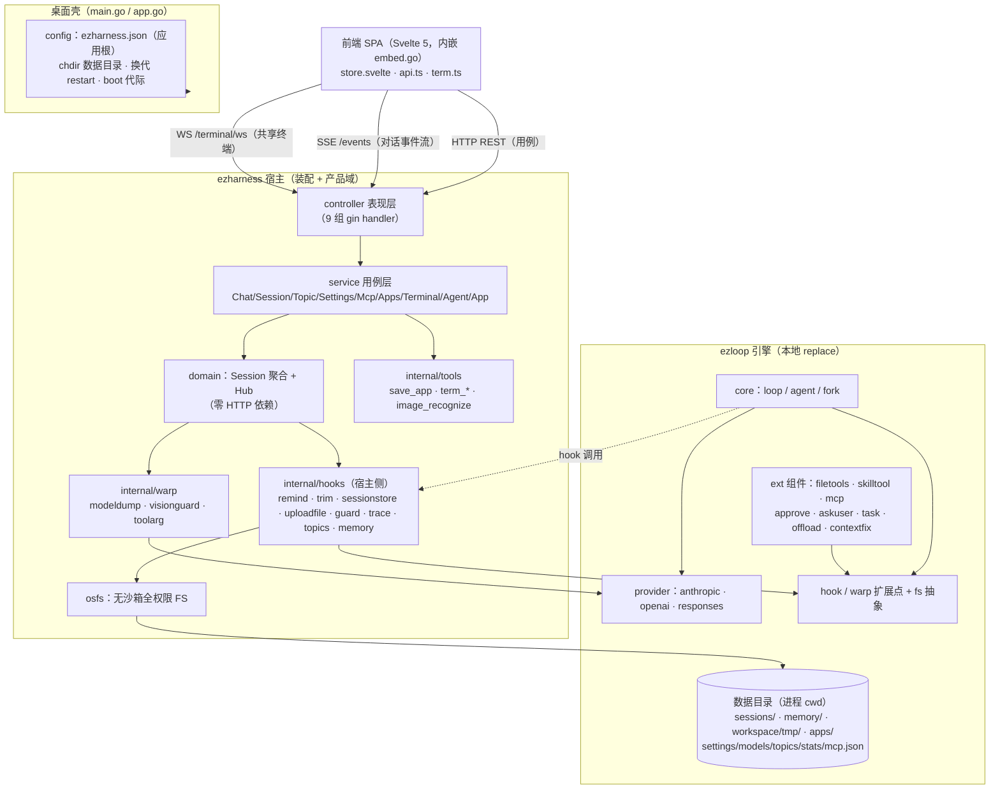

# 系统整体架构

ezharness：基于 ezloop 内核的桌面 agent harness（gin + 三层 MVC）。启动即对本机全权（文件不限目录 + 原生 shell）。桌面形态 = 单二进制内嵌前端 + 原生 WebView 窗口；`EZHARNESS_NO_WINDOW=1` 回落纯 server 模式。

## 〇、总图



## 一、双仓库

| 仓库 | 角色 |
|---|---|
| **ezloop**（`github.com/xuanlv2002/ezloop`，本地 `../ezloop`） | agent 引擎：core 循环（loop/agent）、provider（anthropic/openai/responses 三协议）、hook/warp 扩展点、ext 通用组件（filetools/skilltool/mcp/approve/askuser/task/offload/contextfix） |
| **ezharness**（本仓库） | 宿主应用：装配（选 hook、传参数）+ 产品域（会话树/设置/终端/快应用/前端）+ 自有 hooks（remind/trim/sessionstore 等，依赖 session 状态的留在此侧，见 hooks.md 分界判据） |

开发期 ezharness 的 go.mod `replace` 指向本地 ezloop；发布前 ezloop 升版本、移除 replace。

## 二、应用生命周期

```
main()
 ├─ config.Load()            读应用根 ezharness.json（缺失建默认）
 ├─ newApp(cfg)              adoptLegacy 收编旧数据 → MkdirAll → os.Chdir(数据目录)   ← 进程 cwd = 数据根
 ├─ a.start()                net.Listen 预占端口 → buildRouter() → srv.Serve
 └─ openWindow(a) 阻塞至退出（或 NO_WINDOW 等信号）→ stop()
```

- **buildRouter 换代重建**：`domain.NewHub()`（含 bootstrap 恢复）→ TerminalService → AgentService.Assemble → 全部 controller。设置页改端口/数据目录触发**换代**（restart）：`shutdownGeneration`（杀终端 shell → 取消运行轮并等落盘 → 关 server）→ syncDrained（收尾数据同步新目录）→ chdir → buildRouter。`boot` 代际计数跨代共享，前端据此判断新服务就绪。
- **退出顺序**同理：轮内历史只在 OnEnd 落盘，不等落盘直接退出会丢整轮；SSE 长连直接 `srv.Close()`（优雅 Shutdown 会拖满超时）。
- **应用根 = exe 所在目录**（`config.Root()`，sync.Once 锚定，不受后续 chdir 影响）——exe 在哪运行，ezharness.json 与数据目录就在哪生成（安装版与自编译同规则）。

## 三、分层结构

**controller（表现）→ service（用例）→ domain（会话聚合与事件）**，tools/hooks 为领域扩展，osfs/config 为基础设施，main 只做装配。

| 包 | 职责 |
|---|---|
| `internal/controller` | gin handler 只做绑定、校验与响应，业务在 service |
| `internal/service` | ChatService（发送/取消/决策/事件流消费）、SessionService（bootstrap/状态/历史/摘要）、TopicService（新建/fork/切换/归档换代）、SettingsService + MemoryService、McpService、AppsService、TerminalService（共享终端公共池：ConPTY，用户 WS 与 AI term_* 共写）、AgentService（agent 装配中枢）、AppService（配置/迁移/换代/boot） |
| `internal/domain` | Session（会话聚合并发状态机）+ Hub（全局容器）+ 事件帧，零 HTTP 依赖 |
| `internal/hooks` | 宿主侧 hook：sessionstore（落盘）、sysprompt、trim、remind+reschange（系统提醒）、uploadfile、guard、trace、topics、memory、archive、summarize、recall（预留） |
| `internal/tools` | 自有工具：save_app、term_*（共享终端）、image_recognize（识别槽） |
| `internal/warp` | 装饰器：modeldump（调试打印）、visionguard（无视觉剥图）、toolarg（参数语法糖） |
| `internal/osfs` | 无沙箱全权限文件系统（直连 os，不委托 fs.NewLocal——根挂载前缀检查会误杀） |
| `internal/config` | ezharness.json（端口/监听/数据目录/窗口尺寸） |

## 四、数据目录布局

进程 cwd = 数据目录（启动 chdir；位置由 ezharness.json 的 dataDir 决定，空 = 应用根下 `data/`）。ezloop 各 hook 的相对路径存储自动落此。

| 路径（相对 cwd） | 内容 | 读/写方 |
|---|---|---|
| `ezharness.json`（**在应用根**） | 端口/监听/数据目录/窗口尺寸 | config；AppService 换代时改写 |
| `settings.json` | 运行配置（WorkDir/TrimPercent/MaxIterations/DisabledSkills…） | ensureSettings / SettingsService |
| `models.json` | 模型四槽（main/vision…，端点凭证 + 用量累计） | Hub.RecordUsage 每轮落盘 |
| `toolRules.json` | 工具审批策略 | SettingsService |
| `topics.json` | 分支（线）索引 | hooks.Topics |
| `stats.json` | 跨会话生命体征（累计 usage/轮数） | Stats |
| `mcp.json` | MCP server 配置 | McpService 写；McpHook 读（热加载） |
| `sessions/<id>/` | 会话存档（见 session.md） | sessionstore |
| `memory/longterm/harness.md` | 长期记忆索引（初始进上下文） | EnsureHarnessMd / agent 维护 |
| `memory/skills/` | 技能库（SKILL.md + scripts/） | CreateSkill/Delete / skilltool |
| `apps/` | 快应用 html（save_app 生成） | 静态服务 `/apps/*` |
| `workspace/` | 工作目录（settings.WorkDir 空 = 此默认） | agent 自由读写 |
| `workspace/tmp/` | 用户上传附件暂存（base64 不入上下文） | ChatService 落盘 / read_file 读 |
| `.ezloop/offload/` | 大工具结果卸载区 | offload / guard |

system prompt 的 `<workspace>` 段把此布局（绝对路径）原样告知模型。

## 五、前后端通信（三通道）

| 通道 | 端点 | 承担 |
|---|---|---|
| **HTTP REST** | gin，默认 `127.0.0.1:5260`（可配 0.0.0.0 局域网） | 全部用例操作（会话/设置/模型/分支/mcp/apps/窗口/工作目录文件预览） |
| **SSE** | `GET /api/sessions/:id/events` | 对话事件流（`{type,ts,iter,forkId,data}` 帧）；建连重放（轮进行中回放整轮聚合帧）；断线 pending 补偿。窗口壳不走 wails 资产桥（Windows 下会缓冲整个响应），一律走本进程真实地址 |
| **WS** | `GET /api/terminal/ws` | 魔法看板共享终端：单连接多路复用全部终端（帧带 id 路由），hello 帧带各终端快照，重连即恢复 |

前端 Svelte 5（runes）+ Vite，**手写 fetch 层**（无 wails bindings；前端恒内嵌 embed.go，无 build tag 开关）。全局状态单例 `store.svelte.ts`；事件归约与渲染见 frontend.md。

## 相关文档

- **session.md** — session 设计与 session 树
- **runtime.md** — agent 运行时组成与一轮 chat 全流程
- **frontend.md** — 前端事件定义与渲染
- **hooks.md** — hook/warp 封装原则与分界判据
