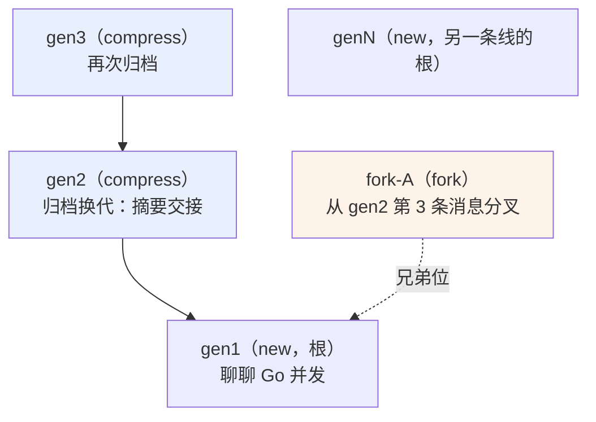
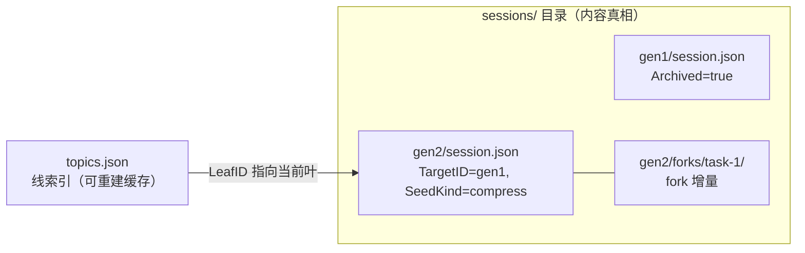
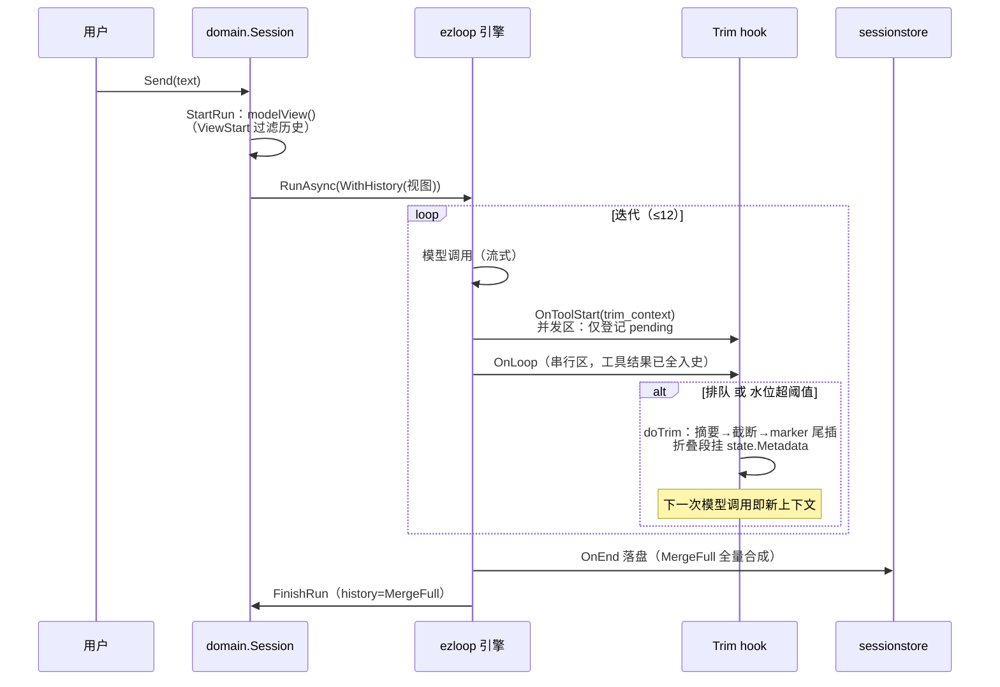
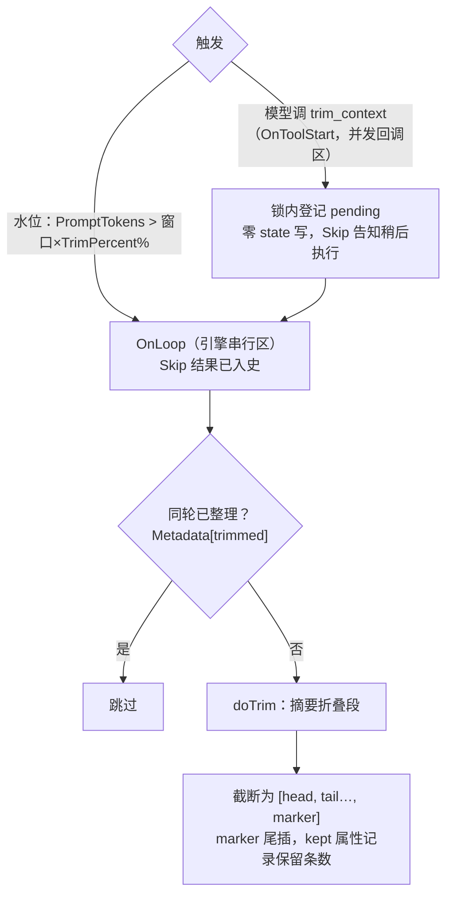
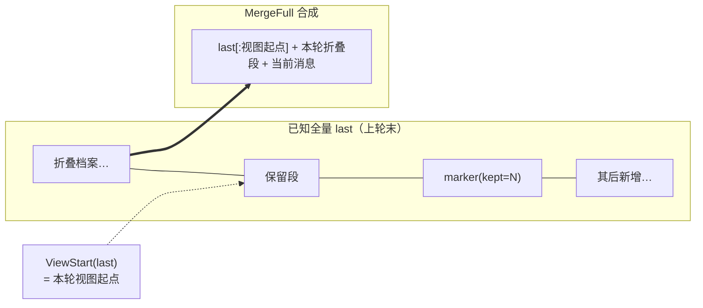
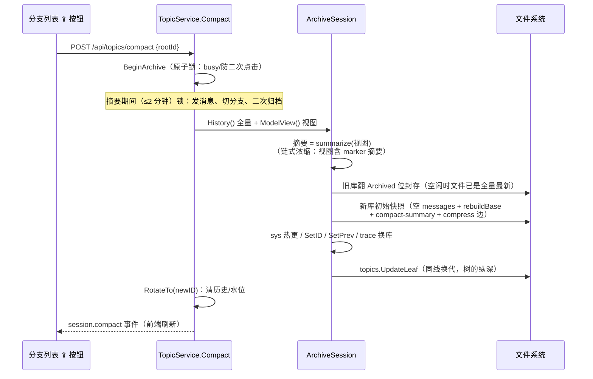

# ezharness 会话与上下文管理

> 版本：2026-08-30 · 描述 trim/archive 分层重构后的当前实现，取代 `contextdesign.md` 中
> 已过时的压缩轮换描述（该文档保留作历史参考）。
> 调试工具：`internal/warp/modeldump` 每轮模型调用前把完整输入打印到后端控制台。

## 0. 总原则：两层职责分离

| 层 | 归属 | 机制 | 时机 |
|----|------|------|------|
| **上下文管理（trim）** | 模型侧 | 水位自动 + `trim_context` 工具，就地折叠、立即生效，会话身份不变 | 迭代回边（OnLoop） |
| **会话树管理（archive / new / fork）** | 用户侧 | 归档按键（同线换代）、新建分支（新线）、消息分叉（兄弟线） | 用户显式操作 |

- **trim 解决运行时问题**：上下文逼近窗口极限时立刻释放空间。
- **archive 解决记忆组织问题**：话题告一段落时封存开新篇（摘要交接、prev 链、同线换代——树的纵深）。
- 注入一律标签语法：`<compact-summary>` / `<context_trim>` / `<end_reason>` / `<agent_status>`。

## 1. 会话树模型

三种用户操作构成一棵节点树：**new = 顶层根，archive = 沿 compress 边向下换代（纵深），fork = 挂在源会话的父下（兄弟位）**。每个叶子节点是一个可进入的分支。



要点：

- **归档链**：gen2 的 `TargetID=gen1`、`SeedKind=compress`；`<compact-summary>` 摘要注入新库 system。
- **fork 的父**：fork 源会话（`targetId`）若是 compress 产物，fork 挂在其父下（与源同级）；源是根则 fork 也是顶层。
- **线的身份**：线根 ID（rootID）稳定——前端路由、SSE 订阅、分支注册表都用它；归档换代只换叶（LeafID），线不新增。

### 存储形态



- `topics.json`：条目身份=线根 ID，记录 LeafID/Title/Msgs/Kind/Origin。`MigrateIndex` 可沿 compress 边从 sessions 全量重建（含 LineRoot 回填）。
- `session.json`：会话完整快照——消息**全量**（含 trim 折叠档案）、system 两段、用量水位、向上边。

## 2. 一轮对话的生命周期



关键点：

- **双视图**：`s.history` 保持全量（前端渲染、时间线可见 trim 分割线）；发给模型的只是 `modelView()`——从 `ViewStart` 起的子集。
- **落盘先于 FinishRun**（引擎内 endHooks 先跑），两处共用 `hooks.MergeFull` 合成全量，与回调顺序无关。

## 3. trim：就地折叠上下文

### 触发与并发契约



- OnToolStart 在 ezloop 契约里同轮并发，写 `state.Messages` 属数据竞争——**排队制**把截断统一延到 OnLoop 串行区。
- fork 同样支持：折叠 `SeedLen` 之后的增量（seed 归主库），seed 完整保留。

### marker 与消息序列

整理后的模型上下文（marker 在尾部，时间序自然）：

```
[system, 保留的近期消息(≤4条，含触发调用的 assistant+tool 对), <context_trim kept="4">…摘要…</context_trim>]
```

- **tailStart 配对完整性**：保留末 K 条为衔接视野；窗口内出现孤儿 tool（配对 assistant 被截在窗口外）则起点前扩纳入其配对——保留段恒为连续无孤儿后缀。
- **摘要 prompt**：延续当前任务（关键事实/已定决定/待办/近期文件操作，200 字内），与归档的交接摘要（300 字）不同。

### 全量档案：MergeFull 不变量

追加式存储——session.json 永远全量，marker 只是分割标记：



**不变量**：`全量 = last 截到视图起点 + 本轮折叠段 + state.Messages`。
视图覆盖段被本轮重新折叠（原文进档案），其前的档案从未进过视图必须保留——违反即跨轮覆盖丢档。落盘（`store.OnEnd`，last=盘上快照）与内存（`FinishRun`，last=history）共用此规则。

### 恢复视图

`ViewStart`：找最后一个 marker，按其 `kept` 属性回溯保留段；clamp 到上一个 marker 之后（不跨折叠边界）。连续 trim 时旧 marker 随折叠段链式归档，视图永远从最新 marker 的保留段开始。

## 4. archive：归档换代（用户按键）



- 摘要输入用**模型视图**而非全量：marker 摘要链已覆盖更早内容，避免重复浓缩。
- 新库先落盘再切内存——任一时刻重启，新库都是可恢复形态。
- 与 `TopicService.Archive`（展示级归档开关，预留）是两个不同操作。

## 5. 配置

| 配置 | 含义 | 默认 |
|------|------|------|
| `trimPercent`（settings.json） | 自动整理水位 = 模型窗口 × 百分比；0 = 禁用（模型仍可主动调 trim_context） | 75 |

换模型自动适配（128K × 75% = 96000 tokens），配置变更经 Reassemble 重算阈值。

## 6. 代码索引

| 关注点 | 位置 |
|--------|------|
| trim hook（双路径 + marker + ViewStart/MergeFull） | `internal/hooks/trim.go` |
| 归档核心（ArchiveSession） | `internal/hooks/archive.go` |
| 落盘全量合成 / 快照 | `internal/hooks/sessionstore.go` |
| 双视图（modelView/FinishRun/归档锁） | `internal/domain/session.go` |
| 归档用例（Compact/Switch 锁） | `internal/service/topic_service.go` |
| 线索引（UpdateLeaf/MigrateIndex） | `internal/hooks/topics.go` |
| 装配（阈值/工具名单） | `internal/service/agent_service.go` |
| endnote 收尾（end_reason） | `internal/hooks/endnote.go` |
