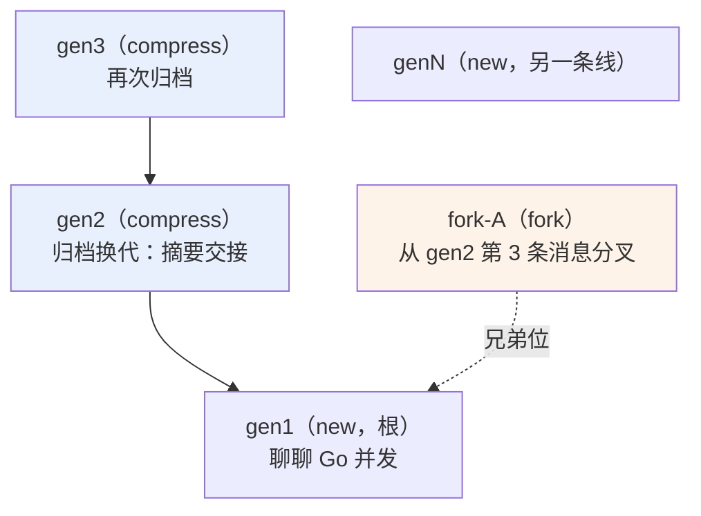
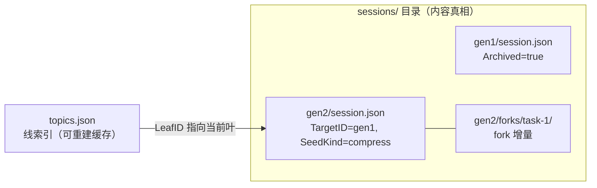
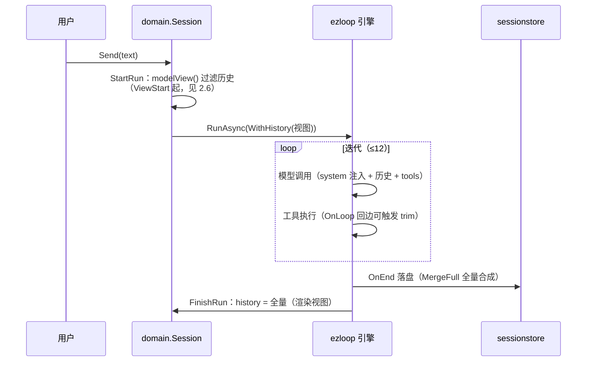
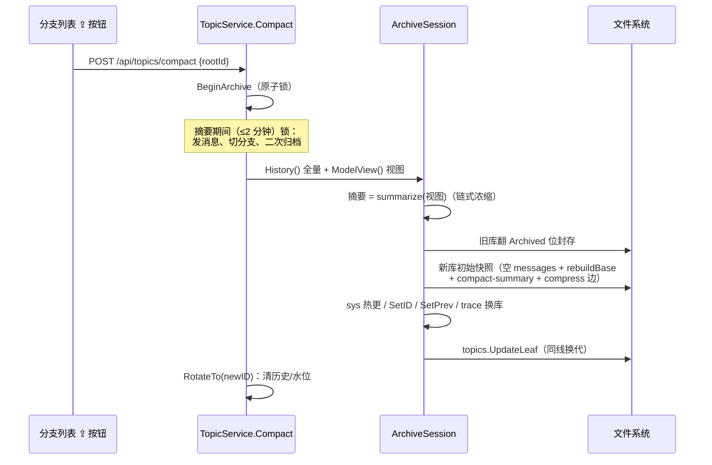
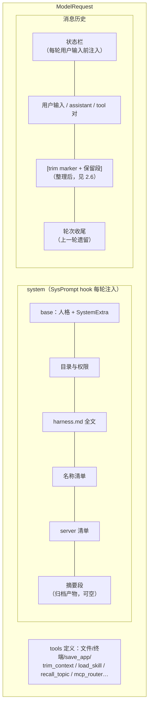
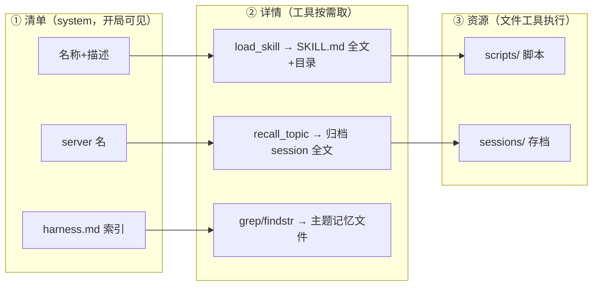
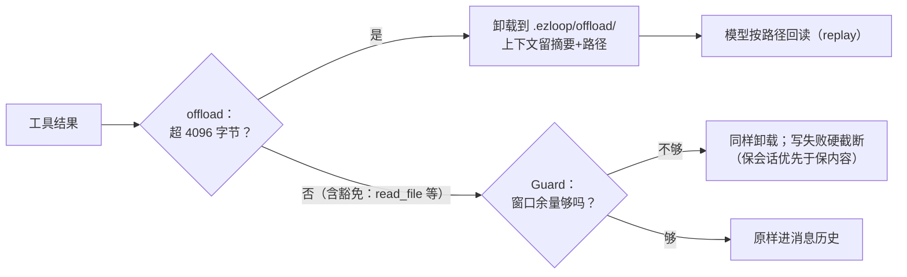
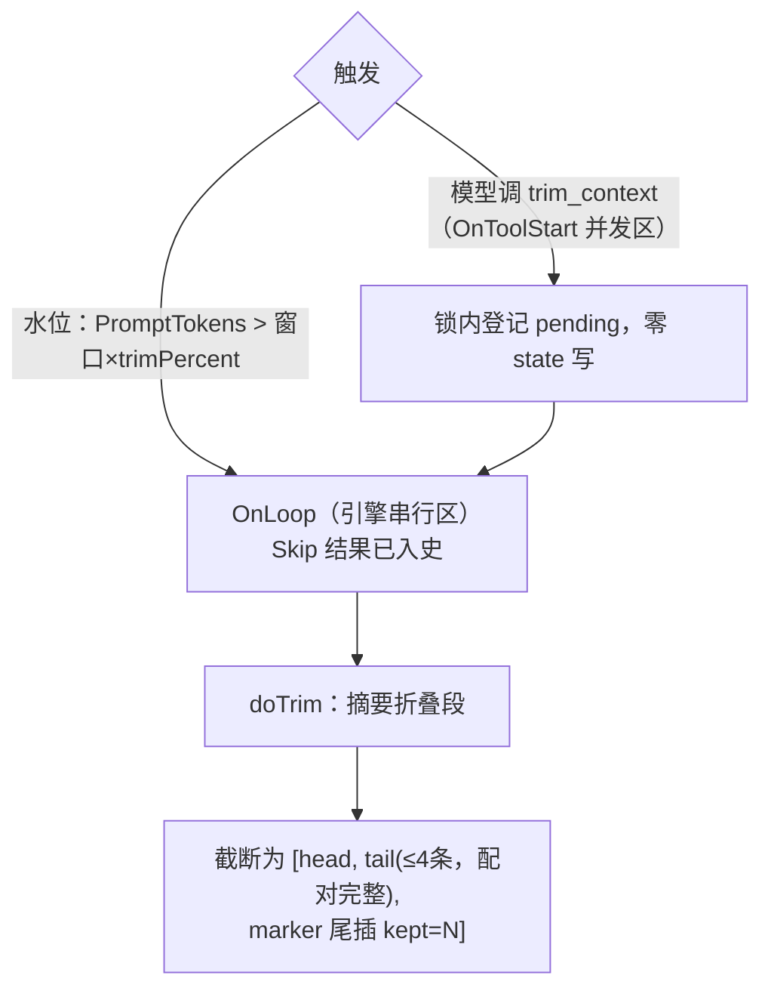

# ezharness 会话管理与上下文管理

> 版本：2026-08-30 · 描述当前实现。两大主题：**Session 管理**（会话树、话题归档、
> 分支切换）与**同一 session 内的上下文管理**（system 组装、每轮注入、按需加载、
> 窗口防线、trim 折叠）。取代 `contextdesign.md` 的过时描述。

---

## 第一部分：Session 管理

### 1.1 会话树模型

三种用户操作构成节点树：**new = 顶层根，archive = 沿 compress 边向下换代（纵深），fork = 挂在源会话的父下（兄弟位）**。每个叶子节点是一个可进入的分支。

- **归档链**：gen2 的 `TargetID=gen1`、`SeedKind=compress`，新库 system 注入 `<compact-summary>` 摘要段。
- **fork 的父**：源会话是 compress 产物则挂其父下（与源同级）；源是根则 fork 也是顶层。fork 体内自带复制前缀（快照隔离）。
- **线的身份**：线根 ID（rootID）稳定——前端路由、SSE 订阅、分支注册表都用它；归档换代只换叶（LeafID），线不新增。

### 1.2 存储形态

- `session.json`：会话完整快照——消息**全量**（含 trim 折叠档案）、system 两段、用量水位、向上边、fork 摘要。
- `topics.json`：条目身份=线根 ID，记录 LeafID/Title/Msgs/Kind/Origin。`MigrateIndex` 可沿 compress 边从 sessions 全量重建（含 LineRoot 回填），索引丢失不丢数据。

### 1.3 一次用户输入的生命周期

- **双视图**：`s.history` 全量（前端渲染）；`modelView()` 是发给模型的子集。
- 落盘（endHooks）先于 FinishRun，两处共用 `hooks.MergeFull`，与回调顺序无关。

### 1.4 归档（archive）

- 摘要输入用**模型视图**（marker 摘要链已覆盖更早内容，避免重复浓缩）。
- 新库先落盘再切内存——任一时刻重启都是可恢复形态。
- 归档即新 session：system base 全量重载（记忆/skill/mcp 变更此刻生效）。

---

## 第二部分：同一 session 的上下文管理

### 2.1 一次模型调用看到的上下文（解剖）

### 2.2 system 的两段式与固定性

`SysPrompt`（`internal/hooks/sysprompt.go`）是 system 唯一来源：`base + summary` 两段。
**内容在 session 创建时组装一次，同 session 内不变**（模型对开局的认知稳定）；轮内变化走状态栏（2.4）。

| 块 | 内容 | 来源 | 变化时机 |
|----|------|------|----------|
| 人格 + SystemExtra | ezharness 定位 + 用户自定义补丁 | `buildSystemBase`（agent_service） | 设置变更 + 下个 session |
| `<workspace>` | 数据目录架构、读写权限、绝对路径 | 同上 | 目录迁移 + 下个 session |
| `<memory>` | 长期记忆索引 harness.md **全文** | `memory/longterm/harness.md` | agent 编辑文件后，下个 session 生效 |
| `<skills>` | 技能名称+描述清单 | `memory/skills/*/SKILL.md` | 新建/关闭技能后，下个 session |
| `<mcp>` | 启用 server 清单 | `mcp.json` | 配置变更后，下个 session |
| `<compact-summary>` | 上一会话归档摘要 | ArchiveSession 写入 | 归档时 |

重启恢复从快照还原两段，不重新组装（记忆/skill/mcp 变更等归档或新线才并入）。

### 2.3 按需加载的三层设计（不进上下文的上下文）

全量内容不塞 system，靠"清单 → 详情 → 资源"分层拉取：

- **skill 三层**：名称进 system（知道有什么）→ `load_skill` 取全文（知道怎么用）→ 文件工具跑 scripts（实际执行）。
- **记忆两层**：harness.md 索引全文进 system；主题记忆文件按需 grep。
- **归档回忆**：`recall_topic` 查看话题索引、加载旧 session 全文——归档不等于遗忘。

### 2.4 每轮动态注入

| 注入 | 时机 | 内容 | hook |
|------|------|------|------|
| `<agent_status>` | 每轮用户输入**前** | 当前时间、上下文水位、距上次输出、本轮资源变更（skill/mcp 增删）、超 70% 建议整理 | `status.go` |
| `<end_reason>` | 每轮结束（落盘前） | 轮次/时长/结束时间/原因分类 | `endnote.go` |
| tool-guide 段 | OnStart 幂等追加 | trim_context 等内部工具用法说明 | `trim.go` 等 |

system 每 session 固定，轮内资源变更靠状态栏传递——直到下个 session 才并入 system。

### 2.5 工具结果的窗口防线

结果进入消息历史前有两道防线（`internal/hooks/guard.go` + ezloop ext）：

`contextfix`（ezloop ext）另负责修理残缺历史（孤儿 tool 消息等恢复场景）。

### 2.6 trim：消息历史维度的整理

system 固定 + 工具结果有防线后，历史本身仍会涨——trim 负责折叠：

- **立即生效**：下一次模型调用即新上下文；session 身份不变（不换库、不动话题线）。
- **追加式档案**：折叠段经 `MergeFull`（不变量：`全量 = last 截到视图起点 + 本轮折叠段 + 当前消息`）保留在 session.json——渲染时间线可见 ✂️ 分割线，历史原文不丢。
- **恢复视图**：`ViewStart` 按最后 marker 的 `kept` 回溯保留段（clamp 不跨上一 marker）；`modelView()` 与落盘共用。
- fork 同样支持（折叠 SeedLen 之后的增量，seed 归主库）。

### 2.7 各机制的窗口分工

| 机制 | 层面 | 动作 | 生效 |
|------|------|------|------|
| offload / Guard | 单条工具结果 | 卸载到文件，留路径 | 即时 |
| trim | 消息历史 | 折叠早期消息为 marker 摘要 | 下次模型调用 |
| archive | 整个 session | 换库 + system 重载 + 摘要交接 | 用户触发 |

---

## 代码索引

| 关注点 | 位置 |
|--------|------|
| system 组装（base 各块） | `internal/service/agent_service.go` buildSystemBase |
| system 唯一来源（两段式） | `internal/hooks/sysprompt.go` |
| 状态栏 / 轮次收尾 | `internal/hooks/status.go` / `endnote.go` |
| skill 三层 / 记忆 / 归档回忆 | `internal/hooks/skilltool.go` / `memory.go` / `recall.go` |
| 窗口防线 | `internal/hooks/guard.go` + ezloop ext offload |
| trim（marker/ViewStart/MergeFull） | `internal/hooks/trim.go` |
| 归档核心 | `internal/hooks/archive.go` |
| 落盘 / 线索引 | `internal/hooks/sessionstore.go` / `topics.go` |
| 双视图 / 归档锁 | `internal/domain/session.go` |
| 归档用例 | `internal/service/topic_service.go` Compact |
